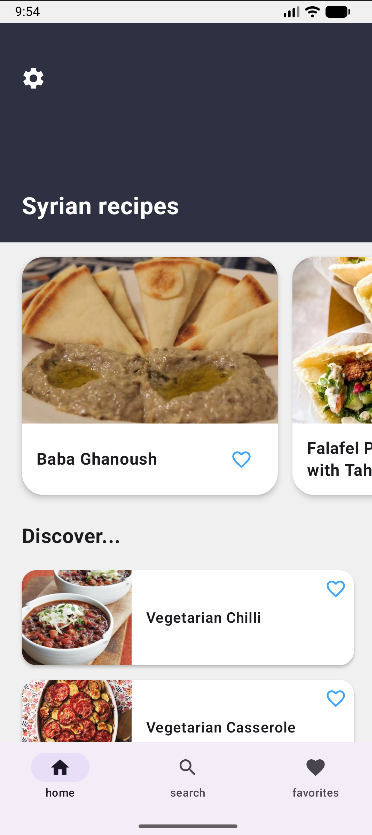
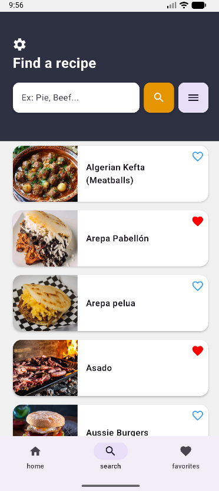
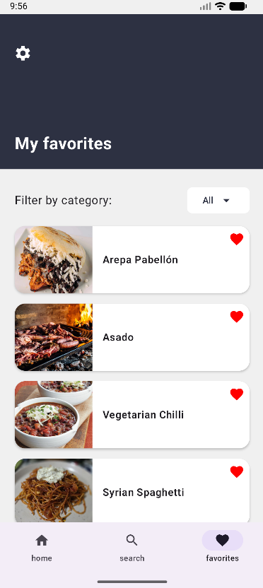
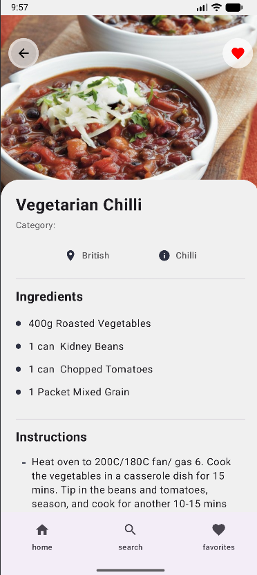
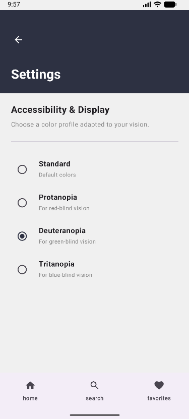

# Savory

Savory is a modern Android recipe application built with Kotlin and Jetpack Compose. It helps users discover new meals, search by ingredients or cuisine, explore detailed cooking instructions, and save favorite recipes for quick access later.

The project is designed to showcase clean Android architecture, a responsive Material 3 interface, and practical mobile app features that feel intuitive and polished.

## Tech Stack

- Kotlin
- Android SDK
- Jetpack Compose
- Material 3
- MVVM architecture
- Navigation Compose
- Retrofit
- Moshi
- Room Database
- Coil for image loading
- Gradle Kotlin DSL

### Architecture

The app follows a clean MVVM pattern, separating the UI, business logic, and persistence concerns:

- UI layer: Compose screens and reusable components
- ViewModel layer: state management and screen logic
- Repository layer: fetches and organizes data
- Data layer: Room and API-based data sources
- Navigation: Compose navigation for screen switching

---

## Overview

Savory was created as a practical mobile app experience focused on making recipe discovery simple and enjoyable. The app connects to a public recipe API, displays curated meal cards, and allows users to browse results in a clean and engaging interface.

Users can:

- Browse featured recipes from multiple countries and categories
- Search for meals by name or ingredient
- Filter by category and country/region
- View detailed recipes with ingredients and step-by-step instructions
- Save recipes to a favorites list
- Access favorite meals locally through persistent storage
- Customize app settings from a dedicated settings screen

---

## App Preview

<div align="center">
  <table>
    <tr>
      <td></td>
      <td></td>
      <td></td>
    </tr>
    <tr>
      <td></td>
      <td></td>
    </tr>
  </table>
</div>

---

## Features

### Home screen
- Displays a welcoming dashboard for recipe discovery
- Shows country-based and random recipe suggestions
- Allows quick access to recipe details and favorites

### Search and filtering
- Search recipes by name or ingredient keywords
- Filter results by category and origin area
- Provides a more guided and targeted discovery experience

### Recipe detail view
- Displays recipe image, category, and origin information
- Lists ingredients in a structured format
- Shows step-by-step cooking instructions
- Includes a favorite toggle for personal saving

### Favorites management
- Saves favorite recipes locally using Room database
- Lets users quickly revisit previously saved meals
- Keeps the list available even when the user leaves the app

### Settings screen
- Provides a dedicated configuration area for the app
- Keeps the UI organized around a clean navigation experience

---

## Project Structure

```text
project/
├── app/
│   ├── src/
│   │   ├── main/
│   │   │   ├── java/be/he2b/savory/
│   │   │   │   ├── data/
│   │   │   │   ├── database/
│   │   │   │   ├── model/
│   │   │   │   ├── network/
│   │   │   │   ├── ui/
│   │   │   │   └── ...
│   │   ├── test/
│   │   └── androidTest/
│   └── build.gradle.kts
├── gradle/
├── build.gradle.kts
├── settings.gradle.kts
├── gradlew
├── gradlew.bat
├── README.md
└── images/
```

---

## Getting Started

### Prerequisites

- Android Studio Hedgehog or newer
- JDK 11+
- Android SDK configured
- A device or emulator running Android 7.0+ (API 24+)

### Installation

1. Clone the repository:

```bash
git clone https://github.com/your-username/savory.git
cd savory
```

2. Open the project in Android Studio.

3. Let Gradle sync the dependencies.

4. Run the app using Android Studio's Run configuration on an emulator or physical Android device.

> Recommended workflow: use the built-in Android Studio run configuration, as it is the most reliable way to launch and debug this Android app in a local development environment.

### Build

If you want to build from the terminal instead of Android Studio, you can use:

```bash
./gradlew assembleDebug
```

This command is valid for the project structure in this repository, but Android Studio is the recommended place to run the app and test it interactively.

---

## Testing

This project includes both local unit tests and instrumented UI tests.

### Run unit tests

```bash
./gradlew testDebugUnitTest
```

### Run instrumented tests

```bash
./gradlew connectedDebugAndroidTest
```

### Recommended testing workflow

- Use Android Studio's test runner for quick local validation
- Run unit tests for business logic and model validation
- Run instrumented tests for Compose UI flows when validating screen behavior

The app includes test coverage for the model, database conversion logic, and key UI screens such as Home, Search, Settings, Favorites, and Recipe Detail.

---

## Data Sources

The app retrieves recipe information from TheMealDB API and uses local persistence for user favorites.

This combination allows:

- dynamic recipe discovery from a large public source
- a personalized, offline-friendly favorites experience
- a smoother UX without needing constant network access for saved items

---

## Screens

- Home
- Search
- Favorites
- Recipe Details
- Settings

Each screen is implemented using Jetpack Compose and follows the app's consistent Material 3 design language.

---

## Why this project is interesting

This application demonstrates:

- Android UI development with Jetpack Compose
- Real API integration with Retrofit and Moshi
- Local persistence with Room
- Practical state handling using ViewModel
- Navigation patterns for multi-screen mobile apps
- A focus on user-centric product design for recipe discovery

This makes the project a strong example of a complete mobile app workflow suitable for portfolio presentation and technical interviews.

---

## Future Improvements

Potential enhancements for the next iteration include:

- ingredient-based shopping list generation
- meal planner and weekly menu features
- light/dark theme personalization
- user authentication and saved collections
- broader offline caching and better error handling
- improved accessibility and localization support

---

## License

This project is currently for educational and portfolio purposes. 

---
